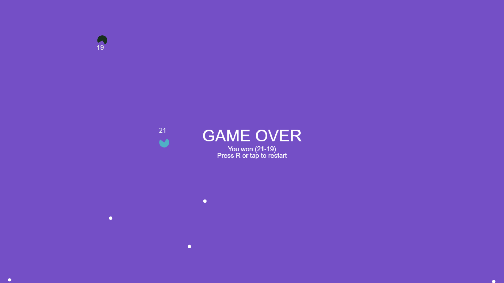

# Peckman

This is a simple browser-based game I made back in 2019, inspired by Pacman, endless runners à la Flappy Bird/Jetpack Joyride/Subway Surfers, and a vague desire to create something on `<canvas>`.

The game is playable as it was back then, on https://remls.github.io/Peckman.

## Objective

Your player character is blue, and the opponent is black. Your objective is to compete with the opponent to gather as many food pellets (small white circles) before time runs out.

The remaining time (in seconds) is shown at the centre of the screen. Each pellet eaten by you will increase the time by 3 seconds, so it is possible for the game to go on endlessly.

Current scores for both characters are shown next to the characters themselves. Each pellet is worth one point.

The game only ends once time runs out. Whichever character ate more pellets is declared the winner.

## Controls

| | PC | Mobile/touch |
| --- | :---: | :---: |
| Rotate player clockwise | Right arrow | Tap bottom-right corner of screen |
| Rotate player counter-clockwise | Left arrow | Tap bottom-left corner of screen |
| Propel player forward (speed burst) | Space | *(Never implemented)* |
| Pause | P | *(Never implemented)* |
| Resume | R (if paused) | *(Never implemented)* |
| Reload the game | R (if not paused) | Tap screen (only at end of game) |

## Room for improvement

I will probably never return to this project again (at the time of writing this, it's now been more than 3 years), but these are some of the ideas I had back then:

- Better mobile controls (using buttons instead of invisible touch areas)
- Complete mobile controls (propel, pause/resume is missing)
- Difficulty selection at start of game
  - I had come up with [difficulty settings and names](https://github.com/remls/remls.github.io/blob/main/game.js#L189-L193) for this purpose already.
- Explaining controls in-game
- Changing background colour of the canvas as the game progresses
  - gradient, based on whether you were winning/losing + by how many points; or ...
  - gradient, based on how much time was remaining
